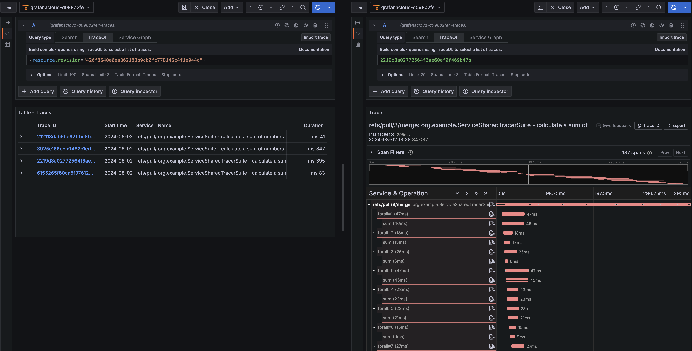
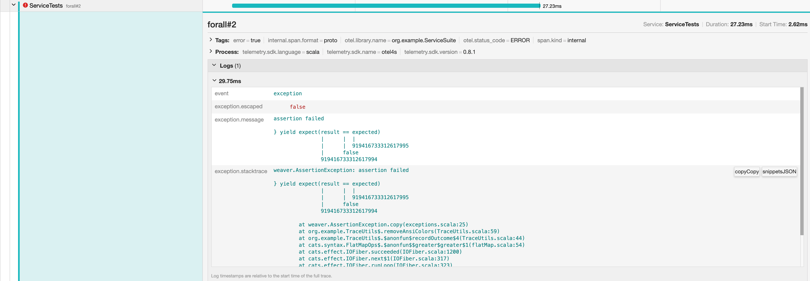

# otel4s 🤝 weaver 🤝 GitHub Actions 🤝 Grafana Cloud

This examples shows how to instrument test with traces using [otel4s](https://github.com/typelevel/otel4s)
and [weaver](https://github.com/disneystreaming/weaver-test) and publish test traces to Grafana Cloud from GitHub
Actions.

Check out the [blog post](https://ochenashko.com/otel4s-test-traces-grafana) for the details.

----

You can investigate traces locally too. 

Launch the OTLP collector and Jaeger in docker:
```shell
docker compose -f docker/observability/docker-compose.yml up -d                   
```

Run tests:
```shell
sbt tests
```

Check out the traces at http://localhost:16686/.

----

Once you configured the Grafana Cloud secrets in GitHub Actions, you can check the results.  
Push your changes, create a PR, the generated link automatically shows all spans associated with the current pipeline run.

### Successful traces



### An errored trace


